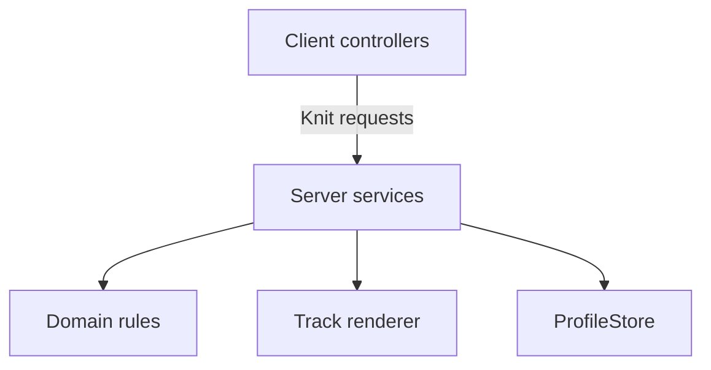

# Gun Runner

**A Roblox runner game built around generated tracks, weapon combat, and persistent progression.**

[](https://github.com/Patch-The-Dev/gun-runner/actions/workflows/ci.yml)

**[Play Gun Runner on Roblox](https://www.roblox.com/games/18336486336/Gun-Runner) · [Project page and gallery](https://www.patchthedev.com/work/gun-runner)**

Gun Runner is a playable Roblox game by [PatchTheDev](https://www.patchthedev.com). This repository presents its gameplay code as a Rojo project, with the rules, server services, client controllers, tests, and Studio integration contract available for review.

A run starts at a player base, builds a track from the player's upgrades, and ends with server calculated rewards. Between runs, players can buy weapons and upgrades, claim timed rewards, and rebirth. The source also covers saved profiles, game passes, and developer products.

**Start here:** [Gameplay](#the-gameplay-loop) · [Systems](#systems-worth-reviewing) · [Architecture](#architecture-at-a-glance) · [Code review](#a-route-through-the-code) · [Setup](#working-with-the-project)

## The gameplay loop

1. **Join and claim a base.** [DataService](src/server/Services/DataService.luau) loads a profile through [PlayerRepository](src/server/Persistence/PlayerRepository.luau). [BaseService](src/server/Services/BaseService.luau) assigns an available tagged base and provides the character's return point.
2. **Generate a run.** [TrackService](src/server/Services/TrackService.luau) creates a seed and reads the player's upgrades. A track plan determines the segments, gates, pads, targets, obstacles, checkpoints, and finish. The server then builds the corresponding Roblox instances.
3. **Move and fight.** [RunnerController](src/client/Controllers/RunnerController.luau) handles responsive local movement and camera behavior. [WeaponController](src/client/Controllers/WeaponController.luau) sends shot requests; the server validates each request and calculates the hit.
4. **Finish and collect.** The server records checkpoints in order and consumes each reward object once. Checkpoint position, segment timing, movement samples, and finish time guard the payout. Cash and target rewards are calculated from the run state, upgrades, and entitlements.
5. **Improve the next run.** Currency pays for weapons and upgrades. Track related upgrades alter subsequent generation; combat and reward upgrades change how those runs play. Rebirth applies a server calculated cost and resets the configured progression.

## Systems worth reviewing

### Track generation and world objects

[TrackPlanner](src/shared/Domain/TrackPlanner.luau) turns a seed and upgrade settings into a track plan without creating Roblox instances. That separation makes generation rules testable in isolation. [TrackRenderer](src/server/Infrastructure/TrackRenderer.luau) takes the plan and creates the world geometry, including the checkpoints used to validate completion.

The upgrade configuration changes track length, finish length, booster strength, and spawn chances for pads, targets, and obstacles. Generated objects carry an `OwnerUserId` attribute and CollectionService tags, so interactions can be routed to the correct player's race. Gates, targets, obstacles, and the evolver also carry a segment index for validation. The renderer sets up stat gates, finish pillars, and an evolver reward when its run requirements are met.

### Combat and race authority

The client supplies an aiming direction, not a hit or damage value. [WeaponService](src/server/Services/WeaponService.luau) checks the payload, keeps aim within a narrow cone around the run direction, limits firing cadence, chooses the firing origin from the player's character, and performs the raycast. Weapon damage, range, and fire rate come from [WeaponConfig](src/shared/Config/WeaponConfig.luau). The shared [network contract](src/shared/Network/Contract.luau) validates structured requests at the server boundary.

[RaceService](src/server/Services/RaceService.luau) owns active runs and rewards. Its [RaceSession](src/server/Domain/RaceSession.luau) tracks checkpoint order and one time claims for targets, gates, obstacles, and pillars. Checkpoints and touch objects require the character to be nearby, in the current segment, and far enough into the run to reach them. The server samples position during the run and again when the character fires or touches an object, cancelling runs with implausible horizontal or vertical jumps. A rolling window prevents repeated samples from spending the position slack on every update. Ascent, descent, and horizontal thresholds live in `TrackConfig` for tuning against measured gameplay. Finish validation also enforces a track-based minimum time. These are server-side plausibility checks for client-controlled character movement; they do not prove every movement was legitimate.

[RequestGateService](src/server/Services/RequestGateService.luau) applies per-player budgets to snapshot, purchase, gift, and fire requests. Shot events reach nearby players through a spatial audience index. The client [tracer renderer](src/client/Systems/ShotTracer.luau) reuses a fixed pool of parts to bound visual object churn.

### Progression, economy, and purchases

The ten upgrades in [ProgressionConfig](src/shared/Config/ProgressionConfig.luau) cover rewards, track layout, and obstacle frequency. [ProgressionService](src/server/Services/ProgressionService.luau) calculates costs, checks purchases, and applies rebirth rules. The five weapons run from the starting Revolver to the Railgun; buying and equipping are checked against the saved profile and current race state. [EconomyService](src/server/Services/EconomyService.luau) handles ordinary currency awards and spending. Timed gifts use a dedicated transaction that validates both resulting balances before changing either currency or the claim cooldown.

[GiftService](src/server/Services/GiftService.luau) handles timed claims through [GiftReward](src/server/Domain/GiftReward.luau), a synchronous transaction with no yielding service calls. [InviteService](src/server/Services/InviteService.luau) awards its bonus from a server observed invite prompt event. [EntitlementService](src/server/Services/EntitlementService.luau) resolves game pass ownership into effects used by the rest of the game, retrying failed lookups while preserving verified results. Developer products go through [MonetizationService](src/server/Services/MonetizationService.luau): a purchase ID is recorded in the profile, and the receipt is acknowledged only after that record has been saved.

### Data and client presentation

[PlayerRepository](src/server/Persistence/PlayerRepository.luau) contains the ProfileStore integration, while [PlayerSession](src/server/Domain/PlayerSession.luau) owns the loaded profile during play. Saved data has a versioned template and [migrations](src/server/Persistence/Migrations.luau) for older records. The load boundary also checks current-version values against configured upgrade limits. Initialization failures release acquired sessions. Shutdown cancels pending acquisitions and waits within one deadline; any late acquisition releases itself instead of registering a new session. Receipt confirmation has a bounded deadline and removes its save/session listeners on completion, failure, or cancellation. An unconfirmed receipt stays eligible for a later Roblox retry. Studio uses ProfileStore's mock store.

On the client, [ClientStore](src/client/State/ClientStore.luau) owns copied, frozen snapshots for presentation. Controllers handle input, UI, and server calls without editing authoritative values. [UIController](src/client/Controllers/UIController.luau) finds tagged interface elements instead of depending on one fixed hierarchy. Trove manages long lived connections and objects.

## Architecture at a glance



Knit provides the service and controller lifecycle. Services coordinate requests and state; domain modules hold rules that can be tested separately. The client reports intent, while the server calculates prices, damage, ownership, and rewards. [Architecture](docs/architecture.md) and [security notes](docs/security.md) explain those boundaries in more detail.

## A route through the code

For a focused review, these files show the main design decisions:

| Start with | What to look for |
| --- | --- |
| [TrackPlanner](src/shared/Domain/TrackPlanner.luau) and [TrackRenderer](src/server/Infrastructure/TrackRenderer.luau) | The boundary between a seeded plan and server created instances. |
| [RaceSession](src/server/Domain/RaceSession.luau) and [RaceService](src/server/Services/RaceService.luau) | Ordered checkpoints, single use interactions, finish checks, and payouts. |
| [WeaponService](src/server/Services/WeaponService.luau) and [WeaponMath](src/shared/Domain/WeaponMath.luau) | Request validation, firing limits, server raycasts, and combat calculations. |
| [Progression](src/shared/Domain/Progression.luau) and [ProgressionService](src/server/Services/ProgressionService.luau) | Cost formulas, purchase checks, upgrade values, and rebirth behavior. |
| [PlayerRepository](src/server/Persistence/PlayerRepository.luau) and [Migrations](src/server/Persistence/Migrations.luau) | Session based persistence, schema changes, and Studio mock data. |
| [TestEZ specs](tests) | Coverage for planning, progression, weapon math, race and receipt flows, request budgets, renderer geometry, client state, and migrations. |

## Working with the project

The toolchain is **Rojo** for source sync and place builds, **Rokit** for pinned tools, **Wally** for packages, **StyLua** for formatting, **Selene** for linting, and **Luau LSP** for full runtime type analysis. Knit, ProfileStore, Trove, and `t` supply the service framework, persistence, cleanup, and request validation. Git tracks the source and configuration.

Install the pinned tools and packages, then connect a Studio place through the Rojo plugin:

```sh
rokit install
wally install
rojo serve default.project.json
```

Build the game source:

```sh
rojo build default.project.json --output GunRunner.rbxlx
```

The [source checks workflow](.github/workflows/ci.yml) verifies the package lock, formatting, lint, all runtime source with Luau analysis, and the game, unit, and multiplayer Rojo builds. Tool versions, Actions, and Roblox type definitions are pinned. The source badge covers those checks.

### Runtime tests

[TestEZ specs](tests) cover generation, progression, weapon math, race rewards, bounded movement, receipt confirmation, initialization cleanup, pending-load shutdown, request budgets, atomic gifts, client state, and migrations. TestEZ and the test scripts are excluded from the normal project.

On Windows with Studio installed and signed in:

```powershell
./tests/RunStudioTests.ps1 -ReportPath "$env:TEMP/gun-runner-runtime.json"
# Select a suite when investigating a failure:
./tests/RunStudioTests.ps1 -Suite Unit
./tests/RunStudioTests.ps1 -Suite Bootstrap
./tests/RunStudioTests.ps1 -Suite Integration
```

| Suite | Execution |
| --- | --- |
| Unit | Domain rules and controlled service flows, including initialization failures, pending loads, receipt save failure and timeout, invalid gift rewards, and rolling movement bounds. |
| Bootstrap | All server services initialize together with the pinned packages. |
| Multiplayer | Two actual Studio clients run the production entrypoints and remote service calls. Checks controller startup, profile loading, replicated gift snapshots, atomic gift payout, duplicate claim rejection, profile isolation, malformed shot rejection, and saved receipt confirmation through mock ProfileStore. Unhandled application errors fail the suite on both clients and the server. |

The isolated fixtures use mock data stores and do not publish or modify a live place. Runtime reports identify the commit, dirty working tree state, finish time, suite totals, and status. Skipped tests, missing results, and timeouts fail the runner. Commerce specs exercise the receipt protocol without creating a real purchase.

The [recorded local Studio run](docs/validation.json) passed **51 unit checks**, the **server bootstrap**, and **14 multiplayer checks** from a clean source commit. The report identifies that commit and its completion time. The Studio workflow generates a fresh report for each automated run.

The [Studio runtime workflow](.github/workflows/studio.yml) runs the same command after successful source checks for trusted `main` pushes, once a dedicated Windows runner is enabled. Forks and pull requests do not run on that signed-in machine. See [Studio CI setup](docs/STUDIO_CI.md). A skipped Studio job does not count as a passing runtime test.

The [architecture](docs/architecture.md), [security notes](docs/security.md), [world contract](docs/world-contract.md), and [source layout](docs/source-layout.md) cover the design in more detail. [ProductConfig](src/shared/Config/ProductConfig.luau) contains product and game pass IDs for the live experience.

**Note:** This repository presents the Gun Runner code as a code portfolio. My day-to-day contribution history is tied to a different GitHub account for organizational clarity and client privacy. The source here is the result of that work, so this account's commit history does not represent the game's full development history however it is the end result of said history. You can [play the full Gun Runner game](https://www.roblox.com/games/18336486336/Gun-Runner).
