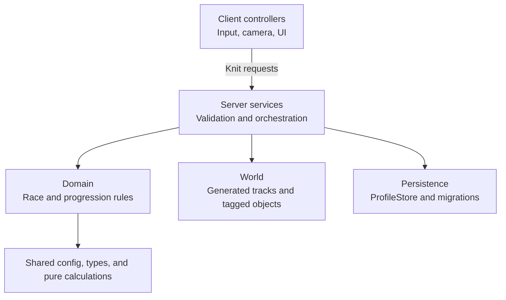

# Gun Runner

**A Roblox runner game built around generated tracks, weapon combat, and persistent progression.**

[](https://github.com/Patch-The-Dev/gun-runner/actions/workflows/ci.yml)

Gun Runner is a Luau code portfolio by [PatchTheDev](https://www.patchthedev.com). It presents the gameplay source as a Rojo project, with the rules, server services, client controllers, tests, and Studio integration contract available for review.

A run starts at a player base, builds a track from the player's upgrades, and ends with server calculated rewards. Between runs, players can buy weapons and upgrades, claim timed rewards, and rebirth. The source also covers saved profiles, game passes, and developer products.

**Start here:** [Gameplay](#the-gameplay-loop) · [Systems](#systems-worth-reviewing) · [Architecture](#architecture-at-a-glance) · [Code review](#a-route-through-the-code) · [Setup](#working-with-the-project) · [Scope](#repository-scope)

## The gameplay loop

1. **Join and claim a base.** [DataService](src/server/Services/DataService.luau) loads a profile through [PlayerRepository](src/server/Persistence/PlayerRepository.luau). [BaseService](src/server/Services/BaseService.luau) assigns an available tagged base and provides the character's return point.
2. **Generate a run.** [TrackService](src/server/Services/TrackService.luau) creates a seed and reads the player's upgrades. A track plan determines the segments, gates, pads, targets, obstacles, checkpoints, and finish. The server then builds the corresponding Roblox instances.
3. **Move and fight.** [RunnerController](src/client/Controllers/RunnerController.luau) handles responsive local movement and camera behavior. [WeaponController](src/client/Controllers/WeaponController.luau) sends shot requests; the server validates each request and calculates the hit.
4. **Finish and collect.** The server records checkpoints in order and consumes each reward object once. A valid finish requires every checkpoint and a plausible elapsed time. Cash and target rewards are calculated from the run state, upgrades, and entitlements.
5. **Improve the next run.** Currency pays for weapons and upgrades. Track related upgrades alter subsequent generation; combat and reward upgrades change how those runs play. Rebirth applies a server calculated cost and resets the configured progression.

## Systems worth reviewing

### Track generation and world objects

[TrackPlanner](src/shared/Domain/TrackPlanner.luau) turns a seed and upgrade settings into a track plan without creating Roblox instances. That separation makes generation rules testable without a place file. [TrackRenderer](src/server/Infrastructure/TrackRenderer.luau) takes the plan and creates the world geometry, including the checkpoints used to validate completion.

The upgrade configuration changes track length, finish length, booster strength, and spawn chances for pads, targets, and obstacles. Generated objects carry an `OwnerUserId` attribute and CollectionService tags, so interactions can be routed to the correct player's race. The renderer also sets up stat gates, finish pillars, and an evolver reward when its run requirements are met.

### Combat and race authority

The client supplies an aiming direction, not a hit or damage value. [WeaponService](src/server/Services/WeaponService.luau) checks the payload, limits firing cadence, chooses the firing origin from the player's character, and performs the raycast. Weapon damage, range, and fire rate come from [WeaponConfig](src/shared/Config/WeaponConfig.luau). The shared [network contract](src/shared/Network/Contract.luau) validates structured requests at the server boundary.

[RaceService](src/server/Services/RaceService.luau) owns active runs and rewards. Its [RaceSession](src/server/Domain/RaceSession.luau) tracks checkpoint order and one time claims for targets, gates, obstacles, and pillars. Finish validation requires all generated checkpoints plus a minimum elapsed time based on the track. These checks guard payouts against direct finish teleports and impossible instant runs. Character movement remains client responsive; the validation is a plausibility check, not a fully server controlled movement simulation.

### Progression, economy, and purchases

The ten upgrades in [ProgressionConfig](src/shared/Config/ProgressionConfig.luau) cover rewards, track layout, and obstacle frequency. [ProgressionService](src/server/Services/ProgressionService.luau) calculates costs, checks purchases, and applies rebirth rules. The five weapons run from the starting Revolver to the Railgun; buying and equipping are checked against the saved profile and current race state. [EconomyService](src/server/Services/EconomyService.luau) is the single service that changes currency balances.

[GiftService](src/server/Services/GiftService.luau) handles timed claims. [InviteService](src/server/Services/InviteService.luau) awards its bonus from a server observed invite prompt event. [EntitlementService](src/server/Services/EntitlementService.luau) resolves game pass ownership into effects used by the rest of the game. Developer products go through [MonetizationService](src/server/Services/MonetizationService.luau): a purchase ID is recorded in the profile, and the receipt is acknowledged only after that record has been saved.

### Data and client presentation

[PlayerRepository](src/server/Persistence/PlayerRepository.luau) contains the ProfileStore integration, while [PlayerSession](src/server/Domain/PlayerSession.luau) owns the loaded profile during play. Saved data has a versioned template and [migrations](src/server/Persistence/Migrations.luau) for older records. Studio uses ProfileStore's mock store.

On the client, [ClientStore](src/client/State/ClientStore.luau) holds local snapshots for presentation. Controllers handle input, UI, and server calls without editing authoritative values. [UIController](src/client/Controllers/UIController.luau) finds tagged interface elements instead of depending on one fixed hierarchy. Trove manages long lived connections and objects.

## Architecture at a glance



Knit provides the service and controller lifecycle. Services coordinate requests and state; domain modules hold rules that can be tested separately. The client reports intent, while the server calculates prices, damage, ownership, and rewards. [Architecture](docs/architecture.md) and [security notes](docs/security.md) explain those boundaries in more detail.

## A route through the code

For a focused review, these files show the main design decisions:

| Start with | What to look for |
| --- | --- |
| [TrackPlanner](src/shared/Domain/TrackPlanner.luau) and [TrackRenderer](src/server/Infrastructure/TrackRenderer.luau) | The boundary between a seeded plan and server created instances. |
| [RaceSession](src/server/Domain/RaceSession.luau) and [RaceService](src/server/Services/RaceService.luau) | Ordered checkpoints, single use interactions, finish checks, and payouts. |
| [WeaponService](src/server/Services/WeaponService.luau) and [WeaponMath](src/shared/Domain/WeaponMath.luau) | Request validation, firing limits, server raycasts, and combat calculations. |
| [Progression](src/shared/Domain/Progression.luau) and [ProgressionService](src/server/Services/ProgressionService.luau) | Cost formulas, purchase checks, upgrade values, and rebirth behavior. |
| [PlayerRepository](src/server/Persistence/PlayerRepository.luau) and [Migrations](src/server/Persistence/Migrations.luau) | Session based persistence, schema changes, and Studio mock data. |
| [TestEZ specs](tests) | Coverage for planning, progression, weapon math, race state, rate limiting, and migrations. |

## Working with the project

The toolchain is **Rojo** for source sync and place builds, **Rokit** for pinned tools, **Wally** for packages, **StyLua** for formatting, and **Selene** for linting. Knit, ProfileStore, Trove, and `t` supply the service framework, persistence, cleanup, and request validation. Git tracks the source and configuration.

Install the pinned tools and packages, then connect a Studio place through the Rojo plugin:

```sh
rokit install
wally install
rojo serve default.project.json
```

Build the source place and the separate TestEZ place:

```sh
rojo build default.project.json --output GunRunner.rbxlx
rojo build test.project.json --output GunRunnerTests.rbxlx
```

The [GitHub Actions workflow](.github/workflows/ci.yml) installs packages, checks formatting and linting, and builds both places on pushes and pull requests. To execute the TestEZ specs, open `GunRunnerTests.rbxlx` in Studio, start a play test, and check Output. Studio test execution is not part of CI.

## Repository scope

This repository contains the gameplay source, project configuration, tests, and documentation. It does not contain the original Studio map, interface assets, animations, or a playable place. A Rojo build proves that the source assembles; it does not recreate the full game on its own. The [world contract](docs/world-contract.md) lists the bases, tags, attributes, and UI elements needed to connect the code to a place. Product and game pass IDs in [ProductConfig](src/shared/Config/ProductConfig.luau) belong to the original experience.

For more detail, read the [architecture](docs/architecture.md), [security notes](docs/security.md), [world contract](docs/world-contract.md), and [refactor scope](docs/refactor-scope.md). See [PatchTheDev's portfolio](https://www.patchthedev.com) for the broader body of work.
